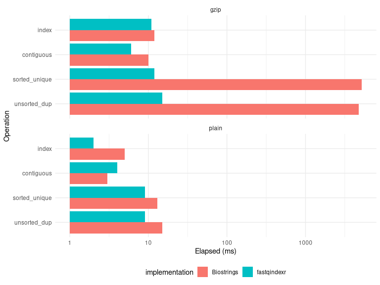

<!-- README.md is generated from README.Rmd. Please edit that file -->

# fastqindexr

<!-- badges: start -->

[](https://github.com/brendanf/fastqindexr/actions/workflows/r-cmd-check.yaml)
[](https://app.codecov.io/gh/brendanf/fastqindexr)
<!-- badges: end -->

`fastqindexr` builds an in-memory index over one or more FASTA/FASTQ
files (gzip-compressed or plain), then extracts records by ID without
scanning from the beginning each time. A single `create_index()` call
must use one compression type (all gzip or all plain). You can also read
binary `.fqi` indexes produced by the FastqIndEx CLI and use them the
same way as in-memory indexes. The package wraps an Rcpp bridge around
adapted open-source
[FastqIndEx](https://github.com/DKFZ-ODCF/FastqIndEx) C++ core
components. It is not written or maintained by the authors of
FastqIndEx.

The package is useful when you want to:

- repeatedly sample or subset records from large FASTA/FASTQ inputs
  (gzip or plain)
- treat several files as one logical concatenated record stream
- keep records in R as a `data.frame`, a named `list` of `seq_id` /
  `seq` (and `qual` for FASTQ), or a named character vector of sequences
  only
- write selected records directly to a plain or gzip-compressed
  FASTA/FASTQ file, preserving request order

## Installation

You can install the development version of fastqindexr from GitHub with:

``` r
# install.packages("pak")
pak::pak("brendanf/fastqindexr")
```

## Example

Build an index once, then request records in any order (including
duplicates):

``` r
library(fastqindexr)

# Make a tiny gzipped FASTQ for demonstration.
path <- tempfile(fileext = ".fastq.gz")
con <- gzfile(path, "wt")
writeLines(
  c(
    "@read1", "ACGT", "+", "!!!!",
    "@read2", "TTAA", "+", "####",
    "@read3", "GGCC", "+", "$$$$"
  ),
  con
)
close(con)

# Index the file (type can also be "auto" or "fasta").
idx <- create_index(path, type = "fastq")
idx
#> <fastqindexr_index>
#>   format: fastq 
#>   files: 1 
#>   records: 3

# Extract by 1-based record ID, preserving request order.
extract_sequences(idx, seq_idx = c(3, 1, 1))
#>   seq_id  seq qual
#> 1  read3 GGCC $$$$
#> 2  read1 ACGT !!!!
#> 3  read1 ACGT !!!!

# Or write the same selection to a FASTA/FASTQ file (plain or .gz).
out <- tempfile(fileext = ".fastq")
extract_sequences_to_file(idx, seq_idx = c(3, 1, 1), outfile = out)
unlink(c(path, out))
```

## Benchmarking

The [`Biostrings` package from
Bioconductor](https://bioconductor.org/packages/Biostrings/) also
provides an implementation of FASTA indexing and extraction via its
`fasta.index()` function. The indexes produced by `fasta.index()` can be
subset and supplied as the `file` argument to `readDNAStringSet()` (or
the equivalent B/RNA/AA versions) to read arbitrary subsets of
sequences. The `fasta.index()` indexes include more details about the
sequences, including sequence names and lengths, which may be useful for
some applications. However, the `readXStringSet()` functions cannot seek
inside gzipped files, and so they are very slow at random-access
extraction from gzipped files.

Here is a benchmark comparing the two implementations, for different
access patterns and compression modes.

``` r
# Install Biostrings if not already installed.
# install.packages("BiocManager")
# BiocManager::install("Biostrings")
library(Biostrings)
library(fastqindexr)

set.seed(1)
n_records <- 10000L
n_extract <- 2000L

# Three different request patterns in increasing order of difficulty:
# 1) A contiguous range of 2000 records, but not at the beginning;
# 2) 2000 unique records, randomly scattered through the file but in increasing
#    order;
# 3) 2000 randomly selected records, including potential duplicates, in
#    arbitrary order.

requests <- list(
  contiguous = (n_records %/% 2) + seq_len(n_extract),
  sorted_unique = sort(sample.int(n_records, n_extract, replace = FALSE)),
  unsorted_dup = sample.int(n_records, n_extract, replace = TRUE)
)

benchmarks <- data.frame(
  compression = character(0),
  implementation = character(0),
  operation = character(0),
  elapsed = numeric(0)
)

# loop over compression modes (gzip / plain)
for (comp in c("gzip", "plain")) {
  if (comp == "gzip") {
    fileext <- ".fa.gz"
  } else {
    fileext <- ".fa"
  }
  tmp <- tempfile(fileext = fileext)
  make_benchmark_fasta(tmp, n = n_records, width = 120)
  
  # loop over implementations (fastqindexr / Biostrings)
  for (impl in c("fastqindexr", "Biostrings")) {
    index_time <- system.time(
      if (impl == "fastqindexr") {
        idx <- create_index(tmp, type = "fasta")
      } else {
        idx <- Biostrings::fasta.index(tmp, seqtype = "DNA")
      }
    )

    benchmarks <- rbind(
      benchmarks,
      data.frame(
        compression = comp,
        implementation = impl,
        operation = "index",
        elapsed = index_time[["elapsed"]]
      )
    )

    # loop over request patterns
    for (r in names(requests)) {
      ids <- requests[[r]]
      extract_time <- system.time(
        if (impl == "fastqindexr") {
          res <- extract_sequences(idx, ids)
        } else {
          res <- Biostrings::readDNAStringSet(idx[ids, ])
        }
      )
      benchmarks <- rbind(
        benchmarks,
        data.frame(
          compression = comp,
          implementation = impl,
          operation = r,
          elapsed = extract_time[["elapsed"]]
        )
      )
    }
  }
  unlink(tmp)
}

benchmarks
#>    compression implementation     operation elapsed
#> 1         gzip    fastqindexr         index   0.011
#> 2         gzip    fastqindexr    contiguous   0.006
#> 3         gzip    fastqindexr sorted_unique   0.012
#> 4         gzip    fastqindexr  unsorted_dup   0.015
#> 5         gzip     Biostrings         index   0.012
#> 6         gzip     Biostrings    contiguous   0.010
#> 7         gzip     Biostrings sorted_unique   5.205
#> 8         gzip     Biostrings  unsorted_dup   4.765
#> 9        plain    fastqindexr         index   0.002
#> 10       plain    fastqindexr    contiguous   0.004
#> 11       plain    fastqindexr sorted_unique   0.009
#> 12       plain    fastqindexr  unsorted_dup   0.009
#> 13       plain     Biostrings         index   0.005
#> 14       plain     Biostrings    contiguous   0.003
#> 15       plain     Biostrings sorted_unique   0.013
#> 16       plain     Biostrings  unsorted_dup   0.015
```

Although `fastqindexr` supports extracting from both gzipped and plain
FASTA/FASTQ files, it is only substantially faster than `Biostrings` in
the cases where `Biostrings` struggles the most: when extracting
*non-contiguous* sets from *gzipped* files. Note the logarithmic scale!

``` r
library(ggplot2)
benchmarks$operation <- factor(benchmarks$operation,
 levels = c("unsorted_dup", "sorted_unique", "contiguous", "index"))
ggplot(benchmarks, aes(y = operation, x = elapsed * 1000, fill = implementation)) +
geom_bar(stat = "identity", position = "dodge") +
facet_wrap(~ compression, ncol = 1) +
scale_x_log10(name = "Elapsed (ms)") +
scale_y_discrete(name = "Operation") +
theme_minimal() +
theme(legend.position = "bottom")
```



## API at a glance

- `create_index(files, type = c("auto", "fasta", "fastq"))`
  - accepts one or many existing FASTA/FASTQ files (all gzip or all
    plain)
  - returns a `fastqindexr_index` object, with subclass
    `fastqindexr_gzip_index` or `fastqindexr_plain_index`
  - this object can be saved to disk with `saveRDS()` and loaded in a
    different session with `readRDS()` (or serialized/deserialized in
    other ways, such as with the
    [`qs2`](https://cran.r-project.org/package=qs2) package)
- `read_fqi_index(fqi_path, files = NULL, type = c("auto", "fasta", "fastq"))`
  - turns one or more FastqIndEx `.fqi` files into a `fastqindexr_index`
    for use with the extract functions
- `extract_sequences(index, seq_idx, file = NULL, return = c("data.frame", "list", "seq"))`
  - `seq_idx` are 1-based positive integer record IDs
  - returns rows in the same order as `seq_idx`
  - duplicate IDs are allowed and duplicated in output
  - for FASTQ, output includes `seq_id`, `seq`, and `qual` when `return`
    is `"data.frame"` or `"list"`; for FASTA, it includes `seq_id` and
    `seq`
  - with `return = "list"`, a list with the same fields; with
    `return = "seq"`, sequences only, named by `seq_id` (duplicates in
    names are allowed; quality lines are not read from the source in
    that mode for FASTQ)
- `extract_sequences_to_file(index, seq_idx, file = NULL, outfile, ...)`
  - writes records in order to a plain or gzip output file (default
    compression follows the `outfile` name)
  - preserves request order and duplicate IDs exactly; supports
    `type = "auto"`, `"fasta"`, or `"fastq"` output
  - when the request is strictly increasing and `append` is `FALSE`,
    extraction does not need to build a full in-memory map of every
    unique ID; with `append` or a non-sorted request, the implementation
    may buffer all unique records like `extract_sequences()`
- `make_benchmark_fasta(path, n = 5000, width = 80)`
  - writes synthetic gzipped FASTA for repeatable benchmark setup

## Important format assumptions

- FASTA support currently assumes one sequence line per record (header
  line + one sequence line)
- files are treated as a logical concatenated stream in the order
  supplied to `create_index()`
- if files move after indexing, you can provide replacement paths via
  the `file` argument in `extract_sequences()` and
  `extract_sequences_to_file()`
